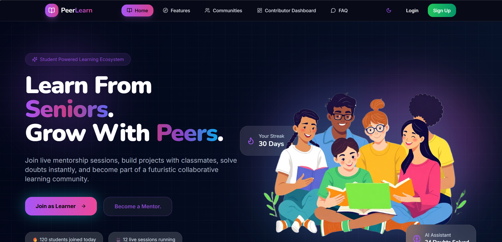
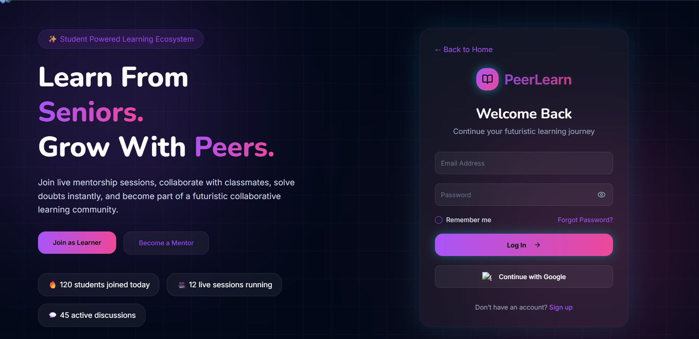
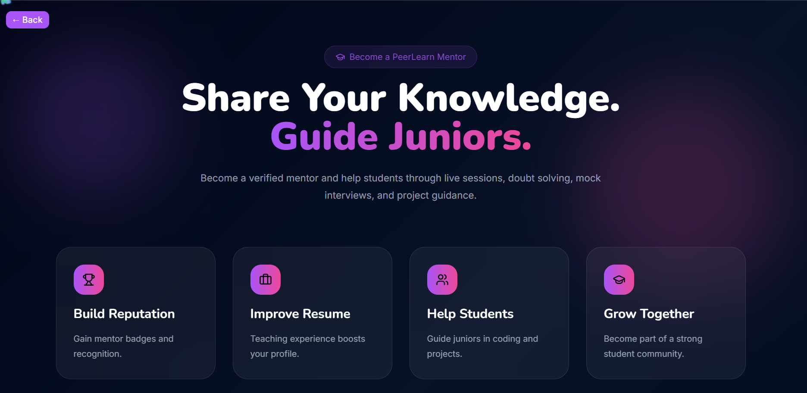
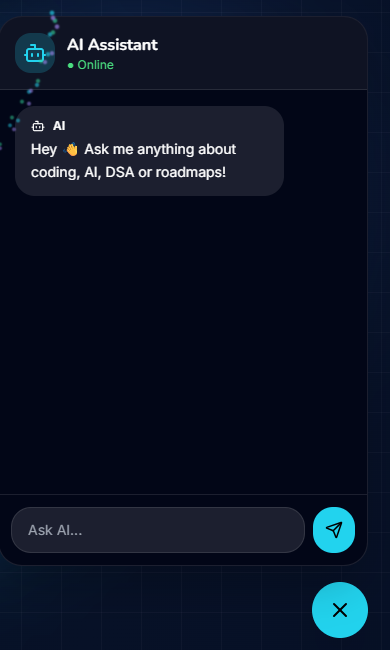
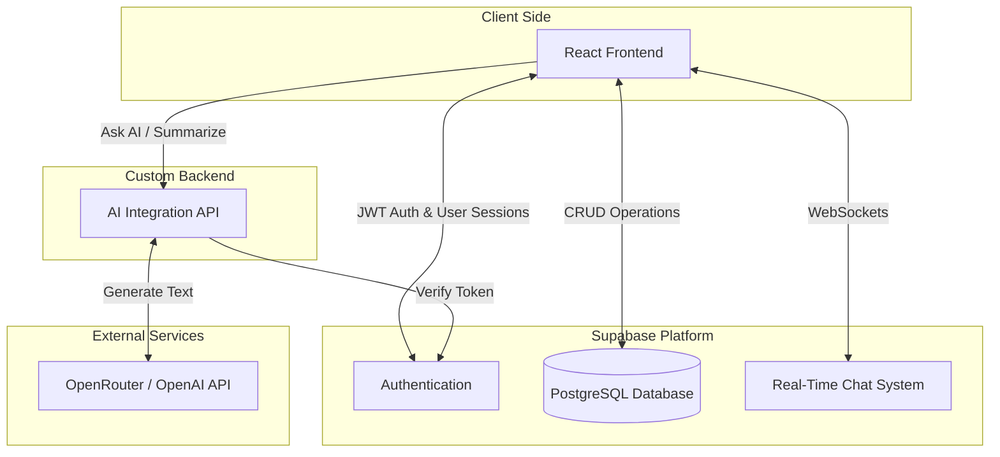
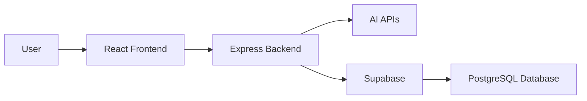
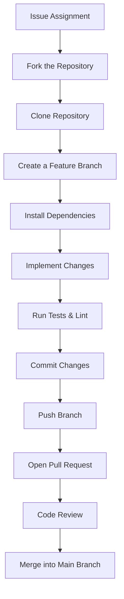

# Peer Learning Platform

<div align="center">


A modern peer-to-peer learning platform where students can connect, collaborate, share knowledge, and grow together through interactive learning sessions, real-time messaging, AI assistance, and community engagement.

---

[](https://react.dev/)
[](https://www.typescriptlang.org/)
[](https://tailwindcss.com/)
[](https://supabase.com/)
[](https://www.postgresql.org/)
[](LICENSE)

</div>

---

## Table of Contents

- [Features](#features)
- [Screenshots](#screenshots)
- [Problem Statement](#problem-statement)
- [Tech Stack](#tech-stack)
- [Security Model](#security-model)
- [System Architecture](#system-architecture)
- [Project Structure](#project-structure)
- [Installation & Setup](#installation--setup)
- [Development Workflow](#development-workflow)
- [Deployment](#deployment)
- [Troubleshooting](#troubleshooting)
- [Feature Roadmap](#feature-roadmap)
- [Contributing](#contributing)
- [Contributors](#contributors)
- [Author](#author)
- [FAQ](#faq)
- [Support](#support)
- [License](#license)

---

## Features

### 🔐 Authentication System
- Secure signup & login
- Protected routes
- User session management

### 👤 User Profiles
- Personalized user profiles
- Skills & interests showcase
- Learning preferences

### 🔍 Peer Discovery
- Find peers based on skills
- Connect with learners worldwide
- Smart matching system

### 📚 Learning Sessions
- Create study sessions
- Join collaborative learning groups
- Interactive peer discussions

### 💬 Real-Time Chat
- Instant messaging system
- Community interaction
- Smooth communication experience

### 🤖 AI-Powered Assistance
- AI chatbot for learning support
- Smart recommendations
- Enhanced user guidance

### 🏆 Leaderboard System
- Rankings based on activity
- Community engagement rewards
- Motivation through gamification

### 📊 Personalized Dashboard
- Track learning progress
- Session overview
- Activity management

### ⚡ Modern Responsive UI
- Fully responsive design
- Mobile-friendly interface
- Smooth user experience

---

## Screenshots

### 🏠 Home Page


### 🔐 Authentication


### 👨‍🏫 Become a Mentor


### 🤖 AI Assistant


### Demo Video
[Watch Demo](https://github.com/user-attachments/assets/6af694a1-e98d-4d31-b99f-eeacddab3ebc)

---

## Problem Statement

Many students struggle to find suitable learning partners, mentors, and collaborative study environments. The **Peer Learning Platform** solves this challenge by enabling students to connect, collaborate, and learn together through peer-to-peer knowledge sharing and community interaction.

---

## Tech Stack

| Category | Technologies |
|----------|--------------|
| **Frontend** | React 18, TypeScript, Vite |
| **UI & Styling** | Tailwind CSS, Radix UI, Shadcn UI, Framer Motion |
| **Backend** | Node.js, Express.js |
| **Database** | Supabase, PostgreSQL |
| **Authentication** | Supabase Authentication |
| **State Management & Data Fetching** | TanStack React Query |
| **Forms & Validation** | React Hook Form, Zod |
| **Charts & Data Visualization** | Chart.js, React Chart.js 2, Recharts |
| **API Communication** | Axios |
| **AI Integration** | OpenRouter API |
| **Video Conferencing** | Jitsi React SDK |
| **Testing** | Vitest, Playwright, Supertest, Testing Library |
| **Code Quality** | ESLint |
| **Deployment** | Vercel |

---

## Security Model

> **⚠️ CRITICAL**: The application's security depends entirely on Row-Level Security (RLS) policies being properly configured in Supabase.

### Public Anon Key

The `VITE_SUPABASE_ANON_KEY` is intentionally public and embedded in the frontend JavaScript bundle. This is expected behavior for Supabase:

- Anyone can view it in the browser's network tab or DevTools → Sources
- Searching for `eyJ` (JWT prefix) instantly finds the key in page source
- This is not a vulnerability; it's the designed authentication method

### Security Boundary: Row-Level Security (RLS)

PostgreSQL RLS policies form the actual security boundary. Every table in the database has:

1. **RLS Enabled**: `ALTER TABLE ... ENABLE ROW LEVEL SECURITY;`
2. **Authentication Policies**: Only `authenticated` users can access data
3. **Authorization Policies**: Users can only see/modify their own data
4. **Sensitive Column Protection**: Scores and badges can only update via server-side functions

### Key Security Principles

- ✅ Every table has RLS enabled
- ✅ Every policy checks `auth.uid()` for user context
- ✅ Sensitive columns (xp, badges) are immutable via direct updates
- ✅ Points only awarded through server-side functions with rate limiting
- ✅ Messages have length limits to prevent storage abuse
- ✅ Audit logs are admin-only and immutable
- ✅ Chat responses are HTML-sanitized to prevent XSS

### Documentation

For detailed RLS policy documentation, see [SECURITY.md](./SECURITY.md).

**Before Deployment**:
1. Review [SECURITY.md](./SECURITY.md) to understand all RLS policies
2. Verify all tables have RLS enabled (use SQL checks in SECURITY.md)
3. Test that users cannot read/modify other users' data
4. Confirm that score updates only work through server-side functions

---

## System Architecture



### Architecture Overview

The Peer Learning Platform follows a modern full-stack architecture designed to provide scalability, maintainability, and real-time collaboration.

**Frontend Layer**
- Built using React 18, TypeScript, and Vite.
- Uses reusable UI components powered by Shadcn UI and Radix UI.
- Handles routing, state management, authentication, and user interactions.
- Uses TanStack React Query for efficient server-state management.

**Backend Layer**
- Built with Node.js and Express.js.
- Processes API requests.
- Handles AI assistant communication.
- Performs request validation and middleware processing.

**Database Layer** — Supabase provides:
- PostgreSQL database
- Authentication
- Real-time subscriptions
- Row Level Security (RLS)

**AI Integration**
The backend securely communicates with the OpenRouter API using direct HTTP requests, keeping API keys server-side while providing intelligent learning assistance.

### Request Flow



This layered architecture keeps the frontend, backend, and database responsibilities well separated, making the project easier to maintain and extend.

---

## Project Structure

```bash
peer-learning-platform/
├── .github/              # GitHub workflows, issue & PR templates
├── .gssoc/               # GSSoC related resources and documentation
├── assets/               # Static assets used across the project
├── docs/                 # Technical documentation (API, Database, etc.)
├── public/               # Public static files served directly
│
├── src/                  # Frontend source code
│   ├── assets/           # Images, icons and static resources
│   ├── components/       # Reusable React components
│   │   ├── chat/             # Chat related UI components
│   │   ├── dashboard/        # Dashboard components
│   │   ├── mentor/           # Mentor related components
│   │   ├── recommendations/  # Recommendation system UI
│   │   ├── resources/        # Learning resources components
│   │   ├── ui/                # Shared UI components (Shadcn/Radix)
│   │   └── whiteboard/        # Collaborative whiteboard components
│   ├── config/            # Application configuration
│   ├── contexts/          # React Context providers
│   ├── hooks/             # Custom React hooks
│   ├── integrations/      # Supabase and third-party integrations
│   ├── lib/               # Shared libraries and helper logic
│   ├── pages/              # Application pages and routes
│   ├── screenshots/        # README screenshots and application previews
│   ├── test/               # Frontend tests
│   ├── types/               # TypeScript type definitions
│   ├── utils/                # Utility/helper functions
│   ├── App.tsx                # Root React component
│   └── main.tsx                # Application entry point
│
├── backend/               # Backend server
│   ├── controllers/       # Request handling logic
│   ├── middlewares/       # Authentication & request middleware
│   ├── routers/           # API route definitions
│   ├── tests/             # Backend tests
│   ├── utils/             # Backend utility functions
│   ├── validation/        # Request validation schemas
│   ├── app.js              # Express application
│   └── server.js            # Server entry point
│
├── supabase/              # Database configuration and migrations
├── package.json           # Project dependencies and scripts
├── vite.config.ts         # Vite configuration
├── tailwind.config.ts     # Tailwind CSS configuration
├── tsconfig.json          # TypeScript configuration
├── CONTRIBUTING.md        # Contribution guidelines
├── TROUBLESHOOTING.md     # Common issues and fixes
└── README.md              # Project documentation
```

### Where should you make changes?

| If you want to... | Modify this location |
|--------------------|-----------------------|
| Create a new page | `src/pages/` |
| Build reusable UI components | `src/components/ui/` |
| Modify chat functionality | `src/components/chat/` |
| Improve dashboard features | `src/components/dashboard/` |
| Work on mentor-related features | `src/components/mentor/` |
| Add recommendation features | `src/components/recommendations/` |
| Update the collaborative whiteboard | `src/components/whiteboard/` |
| Add custom React hooks | `src/hooks/` |
| Manage global state or contexts | `src/contexts/` |
| Configure Supabase integration | `src/integrations/` |
| Add helper or utility functions | `src/utils/` |
| Add backend API endpoints | `backend/routers/` |
| Implement backend business logic | `backend/controllers/` |
| Create middleware | `backend/middlewares/` |
| Add request validation | `backend/validation/` |
| Write backend tests | `backend/tests/` |
| Update technical documentation | `docs/` |

---

## Installation & Setup

### 1. Clone the Repository
```bash
git clone https://github.com/durdana3105/peer-learning.git
```

### 2. Navigate to Project Directory
```bash
cd peer-learning
```

### 3. Install Dependencies
```bash
npm install
```

### 4. Configure Environment Variables

A `.env.example` file is provided in the root of the repository with all required variable names and placeholder values. Copy it to `.env` before running the project:

```bash
cp .env.example .env
```

Then fill in your actual values. You can get your Supabase credentials from the [Supabase dashboard](https://supabase.com/dashboard):

```env
VITE_SUPABASE_URL=your_supabase_url
VITE_SUPABASE_ANON_KEY=your_supabase_anon_key
```

### 5. Start Development Server
```bash
npm run dev
```

### Technical Documentation

For deeper technical insights, refer to:
- [Database Architecture & Schema](./docs/database.md)
- [API Documentation](./docs/api.md)

---

## Development Workflow



1. Fork the repository.
2. Clone it to your local machine.
3. Create a new feature or bug-fix branch.
4. Install all required dependencies.
5. Implement your changes following the project structure.
6. Run linting and tests before committing.
7. Commit your changes with a meaningful commit message.
8. Push the branch to GitHub.
9. Open a Pull Request for review.
10. Address review comments (if any) and wait for approval.

---

## Deployment

This project can be easily deployed on:
- Vercel
- Netlify
- Render

**Build Command**
```bash
npm run build
```

---

## Troubleshooting

If you encounter issues during setup, installation, or configuration, refer to the [Troubleshooting Guide](TROUBLESHOOTING.md) for solutions to common problems.

---

## Feature Roadmap

### ✅ Completed
- **Secure Authentication** — Email/Password and OAuth integration.
- **Real-Time Chat & Study Sessions** — Live messaging and collaborative learning environments.
- **Gamification System** — XP, levels, leaderboards, and streak counts.

### 🚧 In Progress
- **Session Scheduling** — Plan study sessions ahead of time. *(Target: Q3)*
- **AI-based Peer Recommendations** — Smart matching system for peers. *(Target: Q3)*

### 📋 Planned
- **Video Calling Integration** — Seamless face-to-face peer collaboration. *(Target: Q4)*
- **Real-time Notifications** — Alerts for new messages and upcoming sessions. *(Target: Q4)*
- **Mentor Matching System** — Dedicated workflows for connecting students with mentors. *(Target: Q1 2027)*
- **Multi-language Support** — Expanding accessibility for a global audience. *(Target: Q1 2027)*
- **Dedicated Mobile App** — Native applications for iOS and Android. *(Target: 2027)*

---

## Contributing

Contributions are welcome!

### Steps to Contribute

1. Fork the repository
2. Create a new branch
   ```bash
   git checkout -b feature-name
   ```
3. Make your changes
4. Commit your changes
   ```bash
   git commit -m "Add your message"
   ```
5. Push to GitHub
   ```bash
   git push origin feature-name
   ```
6. Open a Pull Request

---

## Contributors

Thanks to all the amazing people who contribute to **Peer Learning**! 💜

<p align="center">
  <a href="https://github.com/durdana3105/peer-learning/graphs/contributors">
    
  </a>
</p>

---

## Author

**Durdana Sultana**
Computer Science (AI & ML) Student

---

## FAQ

**Q: How do I set up the project locally?**
A: Clone the repo, install dependencies, copy `.env.example` to `.env`, fill in Supabase values, then run the development server.

```bash
git clone https://github.com/durdana3105/peer-learning.git
cd peer-learning
npm install
cp .env.example .env   # Update .env with your Supabase values
npm run dev
```

> **Note:** This project standardizes on **npm**. The committed lockfile is `package-lock.json`, and CI/deployment run `npm ci`. Please do not commit lockfiles from other package managers (e.g. `bun.lock`, `bun.lockb`, `yarn.lock`, `pnpm-lock.yaml`).

**Q: What environment variables are required?**
A: Your frontend needs `VITE_SUPABASE_URL` and `VITE_SUPABASE_ANON_KEY` (or supported aliases such as `NEXT_PUBLIC_SUPABASE_URL` / `NEXT_PUBLIC_SUPABASE_ANON_KEY`). The backend uses `SUPABASE_URL` and either `SUPABASE_SERVICE_ROLE_KEY` or `SUPABASE_ANON_KEY`, as well as `OPENROUTER_API_KEY` for AI chat and `SITE_URL` where applicable.

**Q: How should I configure Supabase?**
A: Create a Supabase project and copy the project URL and anon key into `.env`. Enable Supabase Auth, add the required authentication providers, and make sure your auth redirect URL matches your local or deployed site.

**Q: How can I deploy this project?**
A: This repository is configured for Vercel deployment. Deploy the frontend and backend to Vercel, then add the same Supabase environment variables to your Vercel project settings. For local deployment, ensure your `.env` variables are correct and run `npm run dev` for development, or `npm run build` then `npm run preview` for a production preview.

**Q: Why does authentication fail even though I set up Supabase?**
A: Common causes:
- `.env` variables are missing, wrong, or not loaded.
- The site URL in Supabase Auth settings does not match your local URL (`http://localhost:5173`) or deployed URL.
- OAuth provider callback URLs are not configured correctly.

Verify the keys and URLs carefully in both Supabase and the app.

**Q: What should I do if the app still fails to start?**
A: Check these steps:
- Confirm `.env.example` was copied to `.env` and values were filled.
- Run `npm install` again after deleting `node_modules` if dependencies appear broken.
- Make sure your Node.js version is compatible with the repo (CI uses Node 20.x).
- Look for console errors from the frontend or backend and verify the Supabase credentials.

---

## Support

If you like this project, please give it a ⭐ on GitHub!

<p align="center">
  <a href="https://github.com/durdana3105/peer-learning/stargazers">
    
  </a>
  <a href="https://github.com/durdana3105/peer-learning/network/members">
    
  </a>
</p>

---

## License

This project is licensed under the MIT License.

---

<div align="center">

### 🌟 Empowering Students Through Collaborative Learning 🌟

Made with 💜 by the Open Source Community

</div>